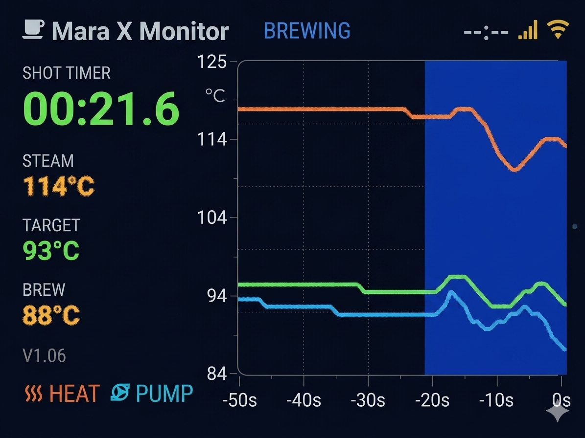

# ESPHome Mara X Display

Temperature, brew timer and recovery-shaded charts for the Lelit Mara X
espresso machine, running on an ESP32-S3 with a 3.5" QSPI touchscreen and
built on ESPHome + LVGL.

> Not affiliated with or endorsed by Lelit. Hobby project, MIT-licensed,
> use at your own risk — especially when wiring into the machine's UART.

## Status

Firmware works end-to-end on the jc3248w535 board. Still looking for:

- a nicer enclosure / mount for the display
- a clean PCB harness for the UART + power wiring into the Mara X

If you've designed something for this combo, open an issue or PR.



## Features

- Live steam / HX / target temperature readout with brew status
- Dual-resolution chart: 1 s sampling / 50 s window when brewing, 15 s / 15 min otherwise
- Auto-switch to high-res on brew start, back to low-res after adaptive recovery
- Shaded context bands on the chart: brew window (blue), recovery (green, 90 s)
- Shot timer at 100 ms precision (MM:SS.D), value persists after the pump stops
- Demo mode with simulated machine cycles when no UART is connected
- Touch controls to toggle resolution and demo mode

## Supported Devices

| Display Model | Status     | Configuration File         |
|---------------|------------|----------------------------|
| jc3248w535    | ✅ Tested   | `jc3248w535-marax.yaml`    |

The board is an all-in-one ESP32-S3 module with a 3.5″ 480×320 QSPI
touchscreen — typically listed under search terms like *"ESP32 S3 3.5
inch LCD Development Board 480x320 Display"*. Internally the panel is
driven by the `qspi_dbi` platform with the `JC4832W535` model, which is
the closest panel ID in ESPHome's driver that drives this controller
correctly.

### Hardware Requirements

- The all-in-one board above (or an ESP32-S3-DevKitC-1 wired to a
  compatible 480×320 QSPI display)
- Touch controller: AXS15231
- UART connection to a Lelit Mara X

### Pin Configuration

| Function          | ESP32-S3 Pin           |
|-------------------|------------------------|
| Display CLK       | GPIO47                 |
| Display Data      | GPIO21, 48, 40, 39     |
| Display CS        | GPIO45                 |
| Display Backlight | GPIO1                  |
| Touch SDA         | GPIO4                  |
| Touch SCL         | GPIO8                  |
| UART TX           | GPIO43                 |
| UART RX           | GPIO44                 |

## Install

### From the browser (easiest)

Open <https://elsbrock.github.io/esphome-marax/> in **Chrome or Edge** on
desktop, plug your ESP32-S3 board in over USB and hit *Install firmware*.
After flashing, the page walks you through WiFi setup via
[Improv](https://www.improv-wifi.com/) — no captive-hotspot dance.

WebSerial only works in Chromium-based browsers (Chrome, Edge, Opera) on
desktop; Safari and Firefox can't flash this way.

### From source

1. **Clone:**
   ```bash
   git clone https://github.com/elsbrock/esphome-marax.git
   cd esphome-marax
   ```

2. **Configure secrets:**
   ```bash
   cp secrets.yaml.example secrets.yaml
   # Fill in wifi_ssid, wifi_password, api_encryption_key,
   # ota_password and ap_password.
   ```

3. **Flash:**
   ```bash
   esphome run jc3248w535-marax.yaml
   ```

If the device can't join your WiFi after flashing, it falls back to a
captive portal on the `Marax-Display Fallback Hotspot` SSID using
`ap_password` from your `secrets.yaml`. Subsequent updates can be sent
over the air via the ESPHome dashboard or Home Assistant.

## Configuration Structure

```
jc3248w535-marax.yaml      # Main hardware config + UART debug parser
config/
├── display_ui.yaml         # LVGL pages and widgets
├── fonts.yaml              # Fonts and Material Design icon glyphs
├── sensors.yaml            # Templates, globals, time, wifi info
└── uart_parser.yaml        # UART timeout + "NO DATA" blink (housekeeping)
includes/
├── chart_helpers.h         # Chart data buffers, averaging, render path
├── chart_draw.h            # Tick-label and shading event callbacks
└── timer_helpers.h         # Shot timer formatting and flashing
```

## Mara X Protocol

The display reads UART at 9600 baud using **inverted serial logic** (this
matters — the Mara X's serial line is inverted relative to standard TTL).
Frames look like:

```
C1.06,116,124,093,0840,1,0\n
```

| Field    | Meaning                       |
|----------|-------------------------------|
| `C1.06`  | Firmware version              |
| `116`    | Steam temperature (°C)        |
| `124`    | Target temperature (°C)       |
| `093`    | HX temperature (°C)           |
| `0840`   | Timer/timestamp (unused here) |
| `1`      | Heating element on/off        |
| `0`      | Pump on/off                   |

## Display Interface

### Layout

- **Top bar:** title, machine status, time, UART signal, WiFi status
- **Left panel:** shot timer, temperature readings (Steam / Target / HX), version, heat + pump indicators
- **Right area:** live temperature chart with shaded brew/recovery bands

### Chart

- Red line: steam temperature
- Blue line: HX/brew temperature
- Green line: target temperature
- Dotted grid; tick labels formatted by a chart draw-event callback
- Time scale: 50 s window in high-res, 15 min window in low-res
- Shaded brew window (blue) and recovery (green, 90 s) bands behind the series
- Auto-switches to high-res on pump start; reverts to low-res once recovery is detected
- Resolution change backfills high-res buffer from the raw data ring, so there's no left-edge gap

### Touch Controls

- **Right edge, mid-screen (~y = 100–180):** toggle demo mode (a hidden hit-strip; the UART icon up top is not the target)
- **Chart area:** switch between 1 s and 15 s resolution
- Demo mode auto-disables as soon as a real UART frame arrives

## Development

### Requirements

- A recent ESPHome (built and tested on 2026.2.x; needs `uart.debug.sequence` which has been available for years)
- ESP-IDF framework (selected via the YAML)

### Modes

**Demo mode** — synthetic data with a small state machine:

- ~60 s cold start-up
- ~5 min ramp to operating temperature
- READY at operating temperature, then a brew cycle every ~30 s after recovery
- Auto-disables when real UART data arrives

**No-data mode** — when the UART has gone quiet for 5 s:

- Blinking "NO DATA" status
- Temperature readouts show `--°C`
- Resumes automatically when the Mara X reconnects

### Architecture notes

- UART parsing is event-driven via `uart.debug.sequence` with a `\n` delimiter — no 10 Hz polling loop
- `update_temperature_displays` caches the last rendered integer value and color band per widget, so labels and styles only get re-applied when something actually changed (otherwise every LVGL setter would invalidate the widget on every 400 ms frame)
- Chart shading and tick labels are drawn from `LV_EVENT_DRAW_PART_END` / `LV_EVENT_DRAW_PART_BEGIN` callbacks; each is scoped to just the part it cares about
- LVGL draw buffer is sized to fit in internal SRAM rather than PSRAM (faster pixel pushes)

## Troubleshooting

### No UART data

- Verify TX/RX wiring
- Confirm `inverted: true` is set on the UART pins — the Mara X's line is not standard TTL polarity
- Watch `marax` log lines; the parser logs each parsed frame at debug level

### Display issues

- PSRAM must be enabled and configured for octal mode (see `psram:` block in main YAML)
- Check QSPI pin wiring against the table above
- Touch I²C: SDA on GPIO4, SCL on GPIO8

### Chart updates feel sluggish

The render path is gated in several places — if you're modifying it, watch for:

- The Y-axis range applies 2 °C hysteresis before rescaling, so small jitter is absorbed
- `get_averaged_temp_at_time` walks the raw buffer backward and stops at the first out-of-window sample (O(k), not O(n))
- Label setters in `update_temperature_displays` are no-ops when the integer reading and color band haven't changed
- The chart is not torn down on brew start / resolution toggle; just the point buffer is resized and the data is refilled

## Contributing

PRs welcome. Keep changes minimal and conventional-commit-style; a short
description of the why (especially for perf-sensitive code) is more
valuable than a wall of restated diff.

## License

MIT — see [LICENSE](LICENSE).

## Acknowledgments

- [ESPHome](https://esphome.io/) for the framework
- [LVGL](https://lvgl.io/) for the graphics library
- Lelit, for an espresso machine worth monitoring
